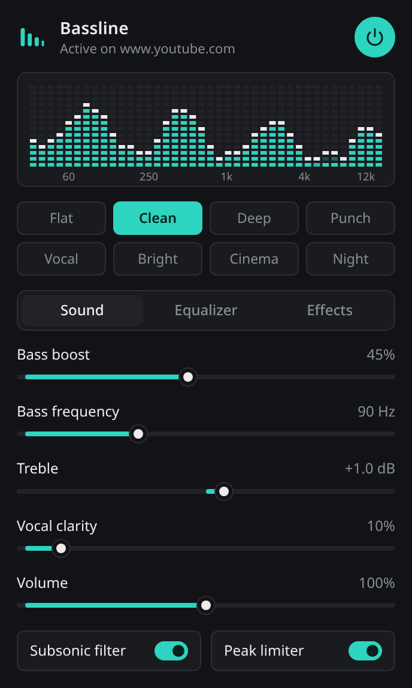

# Bassline Equalizer

Clean bass boost, a 10-band equalizer and sound effects for any Chrome tab. Manifest V3.

Site: https://bassline.imtaqin.id



## Features

- Bass boost with tunable frequency (40–200 Hz) and automatic headroom
- 10-band equalizer, 31 Hz to 16 kHz, ±12 dB
- Presets: Flat, Clean, Deep, Punch, Vocal, Bright, Cinema, Night
- Treble, vocal clarity, volume up to 200%
- Reverb, echo, stereo width, compressor
- Subsonic filter and peak limiter
- Live spectrum meter

## Install

1. Download `bassline.zip` from the [latest release](https://github.com/imtaqin/bassline/releases/latest) and unzip it, or clone this repo.
2. Open `chrome://extensions` and turn on Developer mode.
3. Click Load unpacked and choose the folder.
4. Open a tab that is playing audio, click the Bassline icon and press the power button.

Requires Chrome 116 or newer.

## How it works

The popup asks Chrome for a tab-capture stream ID, and an offscreen document runs the Web Audio chain:

```
tab audio -> headroom -> subsonic filter -> bass shelf + peak -> treble -> clarity
          -> 10-band EQ -> stereo width -> reverb / echo -> compressor -> volume -> limiter -> speakers
```

| File | Role |
| --- | --- |
| `popup.html`, `popup.css`, `popup.js` | Interface, presets, settings storage |
| `background.js` | Creates the offscreen document, tracks active tabs, badge |
| `offscreen.js` | Audio engine |
| `docs/` | Landing page served by GitHub Pages |

## Package

```
zip -r dist/bassline.zip manifest.json background.js offscreen.html offscreen.js popup.html popup.css popup.js icons
```

## Privacy

No data is collected or sent anywhere. Audio is processed locally and never recorded. Settings are kept in Chrome's local extension storage.
